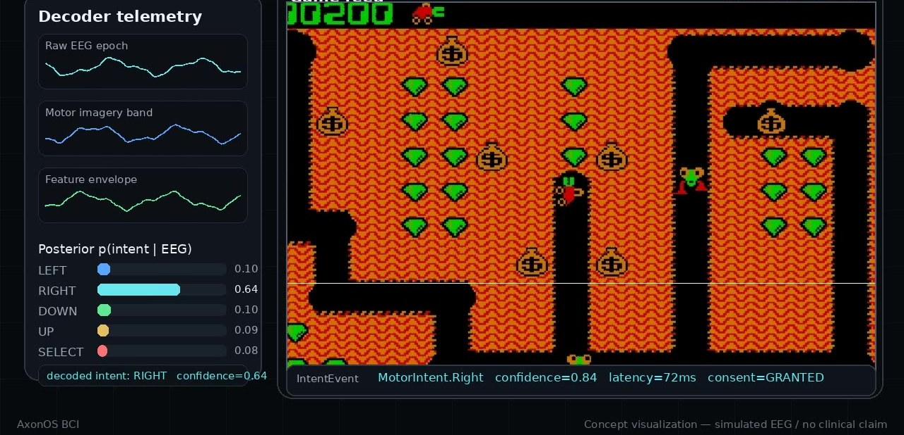

<div align="center">

<br>

# AxonOS

### An open operating layer for brain–computer interfaces

<br>

[](https://github.com/AxonOS-org/axonos-standard)
[](LICENSE)
[](#what-axonos-does-not-claim)
[](https://github.com/AxonOS-org/axonos-kernel)
[](https://axonos.org)

<br>

**[The concept](#the-concept)** &nbsp;·&nbsp;
**[Core thesis](#the-core-thesis)** &nbsp;·&nbsp;
**[Architecture](#the-architecture)** &nbsp;·&nbsp;
**[The stack](#the-axonos-stack)** &nbsp;·&nbsp;
**[Evidence](#evidence-discipline)** &nbsp;·&nbsp;
**[Reading order](#where-to-start)** &nbsp;·&nbsp;
**[Standard ↗](https://github.com/AxonOS-org/axonos-standard)**

<br>

</div>

---

<div align="center">

### The concept

<a href="public/media/AxonOS%20Concept.mp4">
  
</a>

<br>

**▶ [Watch the full concept video](public/media/AxonOS%20Concept.mp4)** &nbsp;·&nbsp; 1:05

<sub>A simulated concept demonstration built from EEG-style telemetry and gameplay input.<br>
It is not a clinical result, not a medical-device demonstration, and not a regulatory claim.</sub>

</div>

---

## What AxonOS is

AxonOS is a pre-clinical technical infrastructure project for the
brain–computer interface boundary. It defines the operating layer that
sits between neural acquisition hardware, real-time signal processing,
consent enforcement, typed neural-intent events, and the applications
that act on them.

It is strictly an operating layer for the brain. It is **not** an
AI-agent framework, **not** a chatbot runtime, **not** a generic Python
SDK, and **not** a token project. Everything below the application —
the timing guarantees, the neural-permission model, the consent state
machine — is specified, openly licensed, and built to be independently
verified.

> **The principle** — applications should receive typed, consent-bound
> intent events, never unrestricted raw neural streams.

---

## What this repository is

This repository — [`AxonOS-org/AxonOS`](https://github.com/AxonOS-org/AxonOS) —
is the **public entry point** to the project. It is deliberately small.
It carries the concept media and serves as the map to the canonical
technical stack; it holds no safety-relevant implementation of its own.

The engineering lives in the dedicated repositories under
[**The AxonOS stack**](#the-axonos-stack). The canonical, normative
specification is [`axonos-standard`](https://github.com/AxonOS-org/axonos-standard).

Read this repository as the project's front door — not as its
implementation.

---

## At a glance

| | |
| --- | --- |
| **Kernel language** | Rust, `#![no_std]`, `#![forbid(unsafe_code)]` |
| **Formal verification** | 28 [Kani](https://github.com/model-checking/kani) harnesses — bounded model checking |
| **Unsafe code** | 0 — forbidden crate-wide |
| **Real-time target** | ARM Cortex-M4F / M33 |
| **Worst-case response** | ≤ 1000 µs, proven (L1); 972 µs measured (L2) |
| **Public repositories** | 7 — every layer of the stack, no private repositories |
| **Engineering RFCs** | 8, in [`axonos-rfcs`](https://github.com/AxonOS-org/axonos-rfcs) |
| **Canonical standard** | [`axonos-standard`](https://github.com/AxonOS-org/axonos-standard) v1.0.0 |
| **Clinical engagement** | 1 MOU — ALS rehabilitation centre, north-eastern US |
| **Evidence held** | L1 (formally proven) + L2 (measured) — no L3 claimed |

<sub>Each figure above is traceable to a repository in the stack. See [Evidence discipline](#evidence-discipline).</sub>

---

## The core thesis

Raw neural data should not become the default application interface.

An operating layer for a brain–computer interface must answer, before
any application runs:

| Question | Where AxonOS answers it |
| --- | --- |
| Which neural-derived data may cross the boundary? | [`axonos-standard` — capability system](https://github.com/AxonOS-org/axonos-standard/blob/main/architecture/capability-system.md) |
| Which application is allowed to receive it? | [`axonos-sdk` — typed-intent boundary](https://github.com/AxonOS-org/axonos-sdk) |
| Which consent state authorised it? | [`axonos-consent` — consent FSM](https://github.com/AxonOS-org/axonos-consent) |
| How long does the event remain valid? | [`axonos-standard` — `STANDARD.md`](https://github.com/AxonOS-org/axonos-standard/blob/main/STANDARD.md) |
| Is raw-signal access structurally prohibited? | [`axonos-standard` — capability system](https://github.com/AxonOS-org/axonos-standard/blob/main/architecture/capability-system.md) |
| Is the event typed, auditable, and provenance-bound? | [`axonos-standard` — `STANDARD.md`](https://github.com/AxonOS-org/axonos-standard/blob/main/STANDARD.md) |

AxonOS treats each of these as a contract to be specified and verified —
not as an implementation detail left to each vendor.

---

## The architecture

```
            neural hardware
                  │
                  ▼   acquisition boundary
        real-time kernel substrate          ← axonos-kernel
                  │
                  ▼   consent + neural-permission enforcement
        deterministic intent processing     ← axonos-consent
                  │
                  ▼   typed neural-intent events
            application SDK                 ← axonos-sdk
                  │
                  ▼
  assistive · research · intelligent applications
```

Every arrow is a contract. The
[Standard](https://github.com/AxonOS-org/axonos-standard) defines what
must hold at each boundary; an implementation is free in everything
else. The four-layer model and the three cross-cutting subsystems —
consent, the Cognitive Hypervisor, and swarm coordination — are
specified in [`STANDARD.md`](https://github.com/AxonOS-org/axonos-standard/blob/main/STANDARD.md).

---

## The AxonOS stack

Every repository below is public. There are no private repositories.

| Repository | Role | Status |
| --- | --- | --- |
| [**`axonos-standard`**](https://github.com/AxonOS-org/axonos-standard) | Canonical technical standard and architecture manual | Canonical · v1.0.0 |
| [**`axonos-rfcs`**](https://github.com/AxonOS-org/axonos-rfcs) | Engineering RFCs and design records | Normative when finalised |
| [**`axonos-kernel`**](https://github.com/AxonOS-org/axonos-kernel) | Real-time `#![no_std]` kernel substrate | Research-grade · v0.2.3 |
| [**`axonos-sdk`**](https://github.com/AxonOS-org/axonos-sdk) | Application-facing SDK and typed-intent boundary | Active · v0.3.5 |
| [**`axonos-consent`**](https://github.com/AxonOS-org/axonos-consent) | Consent finite-state machine and neural-permission reference crate | Pre-clinical reference · v0.4.0 |
| [**`axonos-swarm`**](https://github.com/AxonOS-org/axonos-swarm) | Distributed timing and coordination research | Experimental · v0.2.1 |
| [**`axon-bci-gateway`**](https://github.com/AxonOS-org/axon-bci-gateway) | Acquisition-boundary / OpenBCI hardware-in-the-loop gateway | Non-safety acquisition fork |

Inside the canonical standard, four documents carry most of the weight:
[`STANDARD.md`](https://github.com/AxonOS-org/axonos-standard/blob/main/STANDARD.md) ·
[`VALIDATION.md`](https://github.com/AxonOS-org/axonos-standard/blob/main/VALIDATION.md) ·
[`CONFORMANCE.md`](https://github.com/AxonOS-org/axonos-standard/blob/main/CONFORMANCE.md) ·
[`GOVERNANCE.md`](https://github.com/AxonOS-org/axonos-standard/blob/main/GOVERNANCE.md).

---

## Evidence discipline

AxonOS grades every quantitative claim by the evidence behind it. The
taxonomy is defined normatively in
[`VALIDATION.md`](https://github.com/AxonOS-org/axonos-standard/blob/main/VALIDATION.md)
and summarised here.

| Level | Meaning |
| :---: | --- |
| **L1** | **Formally proven** — a machine-checked proof over the entire admissible input space. |
| **L2** | **Measured** — a measurement taken on the reference hardware under a stated protocol. |
| **L3** | **Independently validated** — reproduced by a party independent of the project. |

The public repositories currently hold **L1 and L2** evidence. AxonOS
does **not** currently claim any **L3** result. A claim's level travels
with the claim — an L2 measurement is never presented as an L1 proof.

---

## What AxonOS does not claim

AxonOS does not currently claim, and this repository must not be read as
claiming:

- FDA clearance, CE marking, or medical-device approval in any jurisdiction;
- clinical efficacy, or independent clinical validation;
- certified medical-device status, or production-implant readiness;
- complete compliance with IEC 62304, ISO 14971, or ISO 13485.

These are possible future milestones. They are not present facts, and
the project records them as such.

---

## Where to start

<details>
<summary><strong>Recommended reading order</strong></summary>

<br>

1. [`axonos-standard` — `STANDARD.md`](https://github.com/AxonOS-org/axonos-standard/blob/main/STANDARD.md) — the canonical specification.
2. [`axonos-standard` — `VALIDATION.md`](https://github.com/AxonOS-org/axonos-standard/blob/main/VALIDATION.md) — the evidence discipline.
3. [`axonos-standard` — `CONFORMANCE.md`](https://github.com/AxonOS-org/axonos-standard/blob/main/CONFORMANCE.md) — how an implementation is tested.
4. [`axonos-standard` — `GOVERNANCE.md`](https://github.com/AxonOS-org/axonos-standard/blob/main/GOVERNANCE.md) — how the Standard evolves.
5. [`axonos-consent`](https://github.com/AxonOS-org/axonos-consent) — the consent finite-state machine in `#![no_std]` Rust.
6. [`axonos-sdk`](https://github.com/AxonOS-org/axonos-sdk) — the typed-intent application boundary.
7. [`axonos-kernel`](https://github.com/AxonOS-org/axonos-kernel) — the real-time kernel substrate.
8. [`axon-bci-gateway`](https://github.com/AxonOS-org/axon-bci-gateway) — the acquisition-boundary gateway.

</details>

<details>
<summary><strong>Frequently asked</strong></summary>

<br>

**Is this a product I can install?**
No. This is the project's entry-point repository. The engineering lives
in the [stack](#the-axonos-stack); the specification is
[`axonos-standard`](https://github.com/AxonOS-org/axonos-standard).

**Is AxonOS a medical device?**
No. See [What AxonOS does not claim](#what-axonos-does-not-claim). A
device built on a conformant implementation remains subject to the full
regulatory regime of every jurisdiction in which it is deployed.

**Can I build a conformant implementation?**
Yes — that is the purpose of an open standard. You need
[`STANDARD.md`](https://github.com/AxonOS-org/axonos-standard/blob/main/STANDARD.md)
and [`CONFORMANCE.md`](https://github.com/AxonOS-org/axonos-standard/blob/main/CONFORMANCE.md).
An independent implementation that passes the conformance suite is
exactly as conformant as the reference implementation.

**Why is this repository mostly empty?**
Because it is a front door, not a workshop. A namesake repository
crowded with implementation would obscure the map. The work is in the
[stack](#the-axonos-stack).

</details>

---

## The project beyond the code

| | |
| --- | --- |
| Website | **[axonos.org](https://axonos.org)** |
| Technology | [axonos.org/technology.html](https://axonos.org/technology.html) |
| Specifications | [axonos.org/specifications.html](https://axonos.org/specifications.html) |
| Research & preprint | [axonos.org/research.html](https://axonos.org/research.html) · [preprint](https://axonos.org/preprint.html) |
| Engineering memo | [axonos.org/memo.html](https://axonos.org/memo.html) |
| Standards & governance | [axonos.org/standards.html](https://axonos.org/standards.html) · [governance](https://axonos.org/governance.html) |
| Roadmap | [axonos.org/roadmap.html](https://axonos.org/roadmap.html) |

---

<div align="center">

<br>

### Contact

[**axonos.org**](https://axonos.org) &nbsp;·&nbsp;
[**github.com/AxonOS-org**](https://github.com/AxonOS-org)

General — connect@axonos.org &nbsp;·&nbsp; Security — security@axonos.org

<br>

<sub>Released under the [MIT License](LICENSE). Repositories in the stack state their own licences —
the canonical Standard is released under CC-BY-SA-4.0.</sub>

<sub>Singapore · Zurich · Berlin · Milano · San Mateo</sub>

<sub>© 2026 The AxonOS Project</sub>

<br>

</div>
